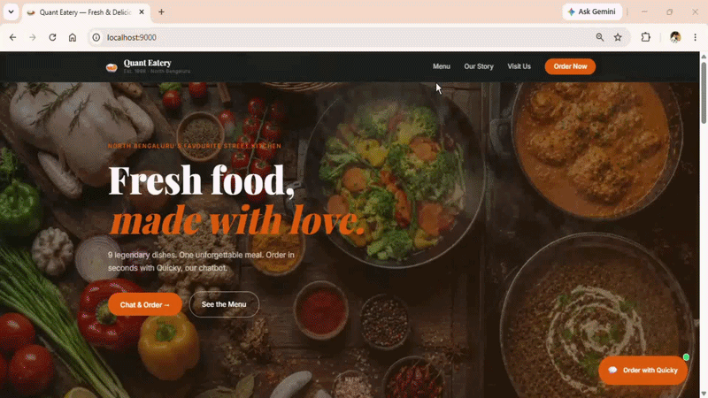
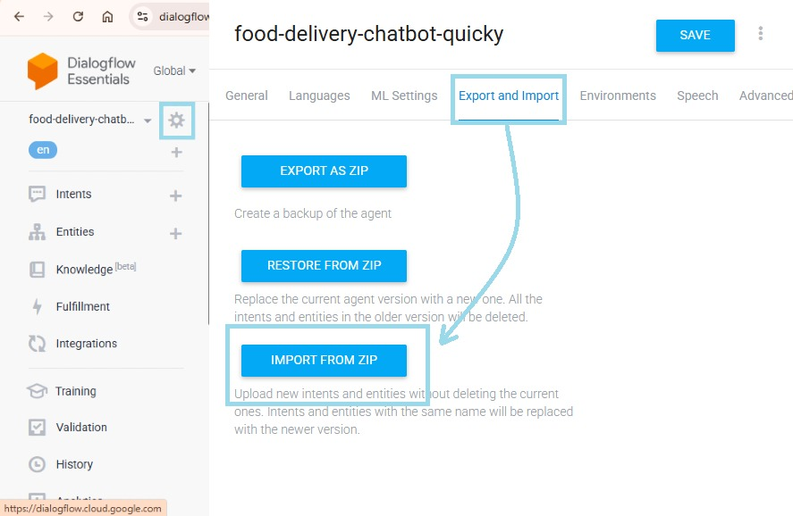
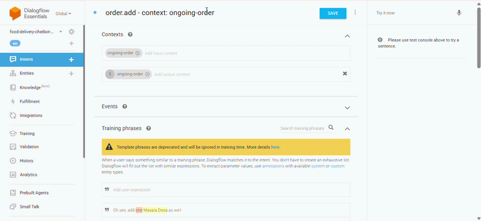

# Quicky : Food Ordering Chatbot (Dialogflow ES + FastAPI)

Quicky is a conversational food-ordering assistant for a fictional restaurant, **Quant Eatery**. It handles placing new orders (add/remove items, complete order) and tracking existing orders by order ID, entirely through natural language.

**Stack:** Dialogflow ES (NLU) → FastAPI (Python backend) → SQLite → HTML/CSS/JS website


*(walkthrough: placing an order and tracking it)*

---

## Features

- **New Order** : add multiple food items with quantities in one sentence ("2 pizzas and 1 mango lassi")
- **Modify Order** : add or remove items mid-conversation before checkout
- **Complete Order** : order is saved to the database and an order ID is returned
- **Track Order** : check delivery status using an order ID
- Session-aware conversation using Dialogflow contexts + a server-side in-progress order buffer

---

## Architecture

```
[Website (HTML/CSS/JS)]
        |  iframe embed
        v
[Dialogflow ES Agent]   ← intent + entity recognition (NLU)
        |  HTTPS webhook (via ngrok in dev)
        v
[FastAPI Backend]       ← session state: in-progress orders
        |
        v
[SQLite Database]
  - food_items
  - orders
  - order_tracking
```

**Why Dialogflow ES over Rasa/a raw LLM?** This is a structured-action problem (order food, track order), not an open-ended generation problem, Dialogflow's intent/entity model plus built-in hosting and integrations got this to a working demo faster than self-hosting an NLU pipeline or wiring up an LLM for something it isn't needed for.

---

## Project Structure

```
quant-eatery-chatbot/
├── main.py                # FastAPI app, webhook entrypoint, intent router
├── db/
│   ├── create_db.py       # schema + seed data
│   └── db_helper.py       # DB read/write helpers
├── utils/
│   └── helper.py          # session ID extraction, formatting helpers
├── frontend/              # website + chat widget embed
├── scripts/
│   └── view_db.py         # dev utility to inspect DB contents
├── docs/                  # demo gif, diagrams
├── .env.example
└── requirements.txt
```

---

## Setup

### 1. Clone and install
```bash
git clone https://github.com/<your-username>/quant-eatery-chatbot.git
cd quant-eatery-chatbot
python -m venv venv
source venv/bin/activate      # Windows: venv\Scripts\activate
pip install -r requirements.txt
```

### 2. Configure environment variables
Copy `.env.example` to `.env` and fill in:
```
DB_NAME=quant_eatery.db
NGROK_AUTH_TOKEN=your_ngrok_auth_token
```

### 3. Run the backend
```bash
python main.py
```
This initializes the SQLite database (first run only) and opens an ngrok tunnel, printing a public HTTPS URL.

### 4. Connect Dialogflow

You have two options here, pick whichever suits you:

#### Option A: Import the pre-built agent (fastest)
A ready-to-import agent export is included at [`dialogflow_agent/QuantEateryAgent.zip`](dialogflow_agent/QuantEateryAgent.zip), with all intents, entities, and contexts already configured.

1. Go to the [Dialogflow ES Console](https://dialogflow.cloud.google.com/) → create a new agent.
2. Open **Settings (⚙️) → Export and Import → Import From Zip**.
3. Upload `QuantEateryAgent.zip` and confirm (this overwrites the new agent with the imported one).
4. Enable webhook fulfillment under **Fulfillment** and paste in the ngrok URL printed when you run `main.py`.


*(Settings → Export and Import → Import From Zip)*

#### Option B: Manual setup
If you'd rather build the agent yourself (recommended if you're learning Dialogflow, since this is what I did first):

1. Create a Dialogflow ES agent and define the intents: `Default Welcome Intent`, `Default Fallback Intent`, `new.order - context: ongoing-order`, `order.add - context: ongoing-order`, `order.remove - context: ongoing-order`, `order.complete - context: ongoing-order`, `track.order`, `track.order - context: ongoing-tracking`.
2. Add the `food-item` custom entity (with synonyms) and use the system entity `@sys.number` for both the `number` parameter (quantities in `order.add`) and the `order_id` parameter (in `track.order - context: ongoing-tracking`).
3. Set up all the settings for each intent, entity, and webhook exactly as described in [`docs/dialogflow-agent-summary.txt`](docs/dialogflow-agent-summary.txt) — see the clip below for how input/output contexts and other params are saved per intent.
4. Enable webhook fulfillment for each intent and paste the ngrok URL printed when you run `main.py` into **Fulfillment → Webhook**.


*(Example: Sample `order.add - context: ongoing-order` intent with input, output context `ongoing-order` and required parameters)*

---

Either way, once the agent is connected, test it in the Dialogflow console's built-in simulator, then embed the Web Demo `<iframe>` in `frontend/index.html` to use it on the website.

---

## Example Conversation

```
User: hi
Bot:  Welcome! You can say New Order or Track Order.

User: new order
Bot:  Starting a new order! Tell me items with quantity.

User: 2 pizzas and 1 mango lassi
Bot:  So far you have: 2 pizza, 1 mango lassi. Anything else?

User: that's it
Bot:  Awesome. We have placed your order. Here is your order id # 260710143210.
      Your order total is 500 which you can pay at the time of delivery!

User: track order
Bot:  Please enter your order ID.

User: 260710143210
Bot:  The order status for order id: 260710143210 is: in transit
```

---

## Known Limitations

- In-progress orders are stored in an in-memory Python dict, so state is lost on server restart and won't scale across multiple backend instances.
- ngrok's free tier URL changes on every restart, requiring the Dialogflow webhook URL to be updated manually.
- No payment integration, order total is quoted for pay-on-delivery only.
- `order_id` is generated from a timestamp (second precision), so two orders placed in the same second could theoretically collide.

## Roadmap
- [ ] Add a "Store Hours" intent (static response, no webhook)
- [ ] Persist in-progress orders to a lightweight store (e.g. Redis) instead of an in-memory dict
- [ ] Swap timestamp-based order IDs for DB auto-increment or UUID
- [ ] Deploy backend somewhere persistent (Render/Railway) to drop the ngrok dependency

---

## What I Learned
This project was built to learn Dialogflow ES end-to-end: intents, entities, contexts, and webhook fulfillment, paired with a FastAPI backend and SQLite storage.


## License

MIT : see [LICENSE](LICENSE) for details.
